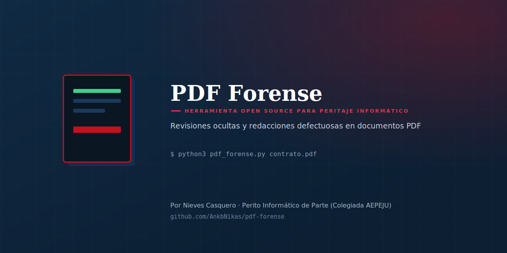
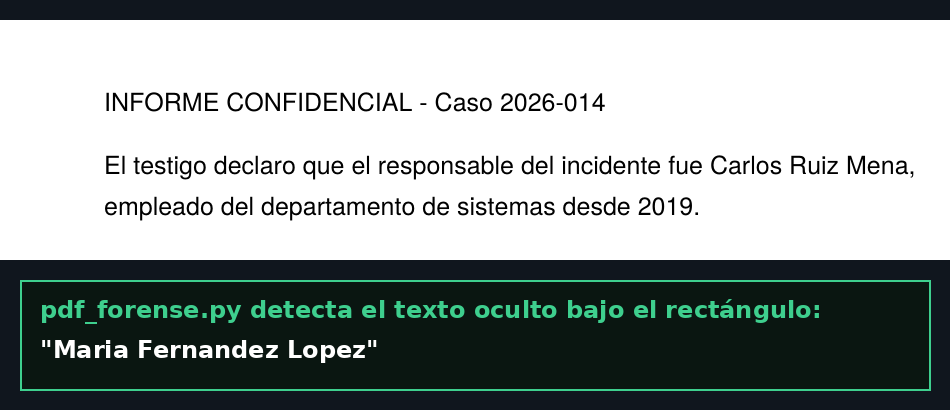

<p align="center">
  
</p>

<p align="center">
  
  
</p>

# PDF Forense

Herramienta de línea de comandos que audita un PDF en busca de dos indicios de manipulación muy concretos y poco conocidos:

1. **Revisiones ocultas** — contenido de versiones anteriores del documento que sigue físicamente presente en el archivo, aunque un lector normal solo muestre la última
2. **Redacciones defectuosas** — texto "tachado" con un rectángulo negro que, en realidad, sigue siendo extraíble por debajo

## ¿Por qué existe esta herramienta?

Un PDF no siempre se reescribe entero al guardarlo. Cuando se anota, se rellena un formulario o se firma en Acrobat, el editor suele añadir una **actualización incremental**: un bloque nuevo al final del archivo, dejando intacto (y recuperable) todo lo anterior. Es exactamente el mismo principio por el que documentos oficiales "redactados" han acabado filtrando el texto que se suponía tapado — porque alguien puso un rectángulo negro encima en vez de eliminar el texto real.

Existen servicios de pago que ofrecen este tipo de auditoría forense de PDF. No encontré una herramienta open source equivalente y accesible, así que la he construido.

## Ejemplo real: importe de un contrato alterado

Con un PDF construido para esta demo (contrato con un importe, guardado, editado y vuelto a guardar — igual que haría alguien en Acrobat), la herramienta reconstruye cada revisión:

```
Revisión 1 — contenido visible en ese momento:
> CONTRATO - Importe a pagar: 1.000 EUR

Revisión 2 — contenido visible en ese momento:
> CONTRATO - Importe a pagar: 100.000 EUR

🔴 El contenido visible difiere entre revisiones.
```

El archivo final solo "muestra" 100.000 EUR — el importe real de la primera versión sigue ahí.

## Ejemplo real: redacción defectuosa

<p align="center">
  
</p>

## Instalación

```bash
git clone https://github.com/AnkbNikas/pdf-forense.git
cd pdf-forense
pip install pypdf pdfplumber
```

## Uso

```bash
python3 pdf_forense.py documento.pdf
python3 pdf_forense.py contrato.pdf --salida informe_caso7
```

| Fichero generado | Contenido |
|---|---|
| `informe_pdf.md` | Informe legible: revisiones, redacciones, metadatos y firma |
| `informe_pdf.json` | Datos estructurados para integraciones |

## Qué comprueba

- 🕵️ **Historial de revisiones**: cuenta los bloques `%%EOF` reales del archivo y reconstruye el contenido visible en cada uno
- ✂️ **Redacciones defectuosas**: cruza la posición de cada rectángulo opaco con el texto extraíble de la página
- 📋 **Metadatos**: software, fechas de creación/modificación
- ✍️ **Firma digital**: detecta su presencia y avisa si conviene revisar si cubre revisiones posteriores (ataque conocido como *incremental update / shadow attack*)

## ⚖️ Límites — lectura obligatoria

- Genera **indicios técnicos**, no una certificación de autenticidad. Para uso judicial, debe incorporarse a un informe pericial completo y firmado.
- La detección de redacciones se basa en solapamiento geométrico; disposiciones no estándar pueden generar falsos negativos o positivos.
- Ausencia de revisiones múltiples no garantiza que el documento sea el original si se reescribió por completo al editarlo (en ese caso no queda rastro incremental que recuperar — solo los metadatos pueden dar alguna pista).

## Licencia

MIT — ver [LICENSE](./LICENSE).

## Autora

**Nieves Casquero** — Perito Informático de Parte (Colegiada AEPEJU), Especialista en Ciberseguridad y Pentester

- GitHub: [@AnkbNikas](https://github.com/AnkbNikas)
- Web: [nievescasquero.github.io](https://nievescasquero.github.io)
- LinkedIn: [nieves-kaskero](https://www.linkedin.com/in/nieves-kaskero/)

Si te resulta útil, una ⭐ en el repositorio ayuda a que llegue a más gente del sector.
